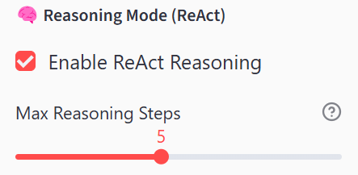
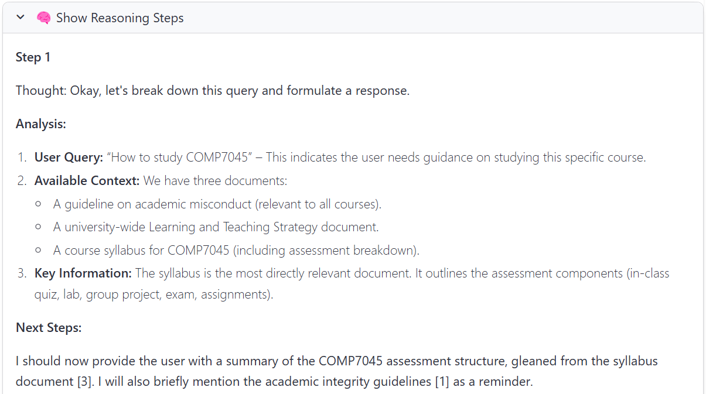
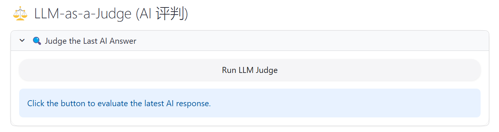

shuyaming部分：
1.创建的文件
HKBUStudyCompanion/src/rag_engine.py

2.实现的功能
实现 HKBU Study Companion 项目的上下文工程部分，包括文档加载、索引构建、词法检索和神经检索功能。

3.调用
安装依赖
pip install ollama numpy
下载模型
ollama pull nomic-embed-text
调用
from src.rag_engine import RAGEngine

# 初始化（只需一次）
engine = RAGEngine(chunk_file="chunks_sliding_500_50.jsonl")

# 词法检索
context, chunks = engine.lexical_search("你的问题", top_k=3)

# 神经检索
context, chunks = engine.neural_search("你的问题", top_k=3)

# 对比两种检索器
result = engine.compare_retrievers("你的问题", top_k=3)

**He Bien Evaluation part**

## Evaluation (`notebooks/evaluation_update.ipynb`)

This notebook is the **main evaluation** artifact. It is designed to run **top-to-bottom** and produce the figures/tables needed for the project report (quality + token-efficiency evidence).

It is also aligned with the **basic unified interface** used in `notebooks/evaluation_basic.py`:

- `rag = RAGEngine(...)`
- `pm = PromptManager()`
- `chat = ChatLogic(rag, pm)`
- `chat.process_query(query, retrieval_type=..., top_k=...)` → returns `response`, `cited_docs`, `total_tokens`, etc.

### What this notebook covers

- **Retrieval sanity check**: lexical vs neural retrieved contexts for a representative query.
- **Evaluation on representative queries**:
  - **Baseline**: **No-RAG vs Neural RAG** (A/B answers + judge scores + winner).
  - **Retriever comparison**: **Lexical RAG vs Neural RAG** (A/B answers + judge scores + winner).
  - **Context optimization**: **Raw vs summarized context** (neural) to show token-efficiency trade-offs.
- **Token-efficiency evidence**:
  - Real token counts from `ollama.generate` via `ChatLogic` (`total_tokens`).
  - Optional approximate context token counts for context-only comparisons.
  - **top_k tradeoff** plots:
    - **quality vs top_k**
    - **quality vs token-usage**
    - **token-usage vs top_k**
- **Visualization**: lexical vs neural wordclouds (falls back to a top-words bar chart if `wordcloud` is not installed).

### Prerequisites

- **Ollama** installed and running.
- Models pulled locally:
  - Embeddings: `nomic-embed-text`
  - Generation / judge: `gemma3:4b` (used in `src/chat_logic.py`; judge model is also set to `gemma3:4b` in the evaluation helpers)

### Environment / dependencies (Windows PowerShell)

If you use the course venv at `e:\HKBU\COMP7125 Prompt Engineering\lab\venv`:

```powershell
cd "e:\HKBU\COMP7125 Prompt Engineering\lab"
.\venv\Scripts\python.exe -m pip install -U pip
.\venv\Scripts\python.exe -m pip install ollama numpy matplotlib pandas
```

Optional (for true wordcloud images):

```powershell
.\venv\Scripts\python.exe -m pip install wordcloud
```

### Data requirement

The RAG engine loads a pre-chunked JSONL file. In the current codebase we use:

- `data/chunks_natural_500_50.jsonl` (default in `src/rag_engine.py`)

If you switch to another chunk file, keep `evaluation_update.ipynb` and `src/main.py` consistent.

### How to run

1. Open `HKBU_Study_Companion-main/HKBU_Study_Companion-main/notebooks/evaluation_update.ipynb`.
2. Run cells **top-to-bottom**, following the “Module / Comparison” markdown headings.
3. If you hit an Ollama OOM error (`memory layout cannot be allocated`):
   - Reduce `top_k`, or reduce output lengths (e.g., `num_predict`) in `src/chat_logic.py`
   - Switch to a smaller local model if necessary (within the course constraint)

### Outputs to include in the report/presentation

- **Baseline results**: No-RAG vs RAG (neural) quality + token comparison.
- **Retriever comparison**: Lexical vs Neural quality + token comparison.
- **Context optimization**: Raw vs summarized (token reduction + quality impact).
- **Figures**:
  - Wordcloud (or bar chart) comparison for Q1 (lexical vs neural).
  - Three top_k tradeoff plots (per retriever).


**He Bien Feature Implementation part**

## Feature Implementation (`notebooks/feature_implementation.ipynb`)

This notebook demonstrates the **required project features** using the same **unified interface** as `notebooks/evaluation_basic.py`:

- `rag = RAGEngine(...)`
- `pm = PromptManager()`
- `chat = ChatLogic(rag, pm)`
- `chat.process_query(query, retrieval_type=..., top_k=...)` → returns:
  - `response`
  - `cited_docs`
  - `total_tokens`
  - `mode` / `retrieval_type` / `context_used`

### What is inside

- **Multi-turn conversation memory**: runs two turns back-to-back and relies on `ChatLogic.history`.
- **Study-plan templates**: suggested input/output structure for planning requests.
- **Study-plan demo (Neural RAG)**: generates a plan and prints `response`, `cited_docs`, and `total_tokens`.

### Prerequisites

- **Ollama** installed and running.
- Models pulled locally:
  - Embeddings: `nomic-embed-text`
  - Generation: `gemma3:4b` (used inside `src/chat_logic.py`)

### How to run (PowerShell)

From the lab folder:

```powershell
cd "e:\HKBU\COMP7125 Prompt Engineering\lab"
.\venv\Scripts\python.exe -m pip install -U pip
.\venv\Scripts\python.exe -m pip install ollama numpy
```

Then open:

- `HKBU_Study_Companion-main/HKBU_Study_Companion-main/notebooks/feature_implementation.ipynb`

Run cells **top-to-bottom**.

### Notes / expected behavior

- The study-plan output quality depends on whether the indexed corpus (the chunk file loaded by `RAGEngine`) contains relevant documents (e.g., **exam timetable**). If the corpus lacks exam dates, the assistant should explicitly state what information is missing.
- The demo prints `cited_docs`. If you need citation tags like `[1]` in the answer text, make sure the underlying prompt rules enforce it strongly (see `src/prompt_manager.py`).

# Introduction of ReAct & LLM-as-a-Judge  (Cai Xueying Part)
## Introduction of ReAct 
### 🚀 Core Features
  - Implements Thought-Action-Observation loop reasoning
  - Configurable reasoning steps from the UI
  - Fully traceable reasoning process with detailed steps shown in the UI
  - Supports custom action handlers

### 📦 Added Modules

- ✅ **src/react_engine.py**
  - Core ReAct reasoning engine
  - Implements the Thought-Action-Observation loop
  - Supports action registration and callback mechanisms
  - Complete step management and reasoning tracing

- ✅ **src/react_prompt_manager.py**
  - ReAct-specific prompt generation
  - Supports 4-stage prompt optimization
  - Interface-compatible with the standard PromptManager

---

### 🔧 Modified Modules

- [x] **src/chat_logic.py**
  - Added ReAct engine attribute
  - Implemented a hook system (4 hook points)
  - Added `enable_react()` / `disable_react()`
  - Added `register_hook()` method
  - Implemented dual reasoning paths (standard + ReAct)
  - Supports the `use_react_override` parameter

- [x] **src/app.py**
  - Imported ReActEngine
  - Initialized ReAct engine in session_state
  - Added ReAct control panel in the sidebar
  - Implemented enable/disable toggle
  - Implemented UI components to display detailed reasoning steps
  
---

### 🧪 How to Run?
Run the full HKBU_Study_Companion application with integrated ReAct:

```bash
# Run the full Streamlit application
streamlit run src/app.py
```
---

### Display of operation results
On the Sidebar, you can choose whether to use ReAct for deep thinking, and you can adjust the number of thinking steps:
<figure>
  
  <figcaption><strong>Fig:</strong> Sidebar ReAct Control Panel</figcaption>
</figure>

You can expand here to show detailed reasoning steps:
<figure>
  
  <figcaption><strong>Fig:</strong> Show Reasoning Step</figcaption>
</figure>

## Introduction of LLM-as-a-Judge

### Added Modules
- Added `judge_engine.py`, encapsulating LLM-as-a-Judge logic.
- Added `judge_response` method in ChatLogic.
- Added an "LLM Judge" button in app.py that supports evaluating the most recent AI response and displaying scores, reasoning, and suggestions as shown below:

<figure>
  
  <figcaption><strong>Fig:</strong> LLM_as_a_judge</figcaption>
</figure>

### Purpose
`LLM_judge_engine.py` implements the LLM-as-a-Judge (large language model automatic evaluator) function. It uses large language models (such as gemma3:12b) to perform automated quality assessment on answers generated by the question-answering system, outputting scores, reasoning, and improvement suggestions.

### Main Features
- **Automatic Evaluation**: Automatically generates a 1–5 score, brief comments, and improvement suggestions by inputting a user query, AI answer, and optional context.
- **Configurable Models**: Supports specifying different LLM models (such as gemma3:4b, gemma3:12b) for evaluation.
- **Standardized Output**: Outputs a structured dict including `score`, `reasoning`, and `suggestion` fields for easy frontend display and subsequent processing.

### Usage Example
```python
from LLM_judge_engine import JudgeEngine

judge = JudgeEngine(model="gemma3:12b")
result = judge.judge(query="What is RAG?", answer="RAG means ...", context="...")
print(result)
# Output: {'score': 4, 'reasoning': 'Answer is mostly correct...', 'suggestion': 'Add more detail...'}
```
